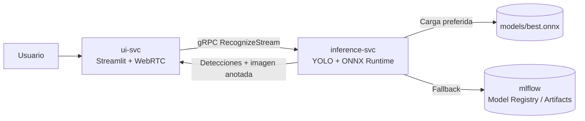
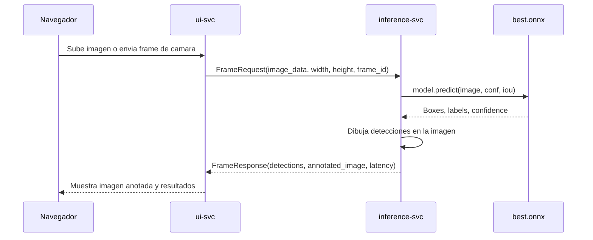

# vc-lenguaje-senas

Sistema de reconocimiento de lenguaje de senas con una arquitectura de microservicios en Docker. La interfaz Streamlit envia imagenes o frames de video a un servicio gRPC de inferencia, y el servicio de inferencia ejecuta un modelo YOLO exportado a ONNX para devolver detecciones y una imagen anotada.

## Estado actual

El flujo local queda funcional con Docker Compose usando un modelo ONNX montado en `./models/best.onnx`. El servicio tambien conserva soporte para MLflow como fallback cuando no se configura un modelo local.

URLs locales principales:

| Servicio | URL |
|---|---|
| UI Streamlit | `http://localhost:8501` |
| gRPC inference | `localhost:50051` |
| MLflow | `http://localhost:5050` |

## Arquitectura



## Servicios

| Servicio | Contenedor | Puerto | Responsabilidad |
|---|---|---:|---|
| `ui-svc` | `sign-ui` | `8501` | Frontend Streamlit para subir imagenes y procesar video por WebRTC. |
| `inference-svc` | `sign-inference` | `50051` | Servidor gRPC que decodifica imagenes, ejecuta YOLO y devuelve detecciones. |
| `mlflow` | `sign-mlflow` | `5050 -> 5000` | Tracking/model registry local. Se mantiene como fallback y herramienta de gestion. |

## Flujo de inferencia



## Contrato gRPC

El contrato esta definido en `proto/vision.proto`.

```proto
service SignLanguageRecognizer {
  rpc RecognizeStream(stream FrameRequest) returns (stream FrameResponse);
}

message FrameRequest {
  bytes image_data = 1;
  int32 width = 2;
  int32 height = 3;
  int32 frame_id = 4;
}

message FrameResponse {
  repeated Detection detections = 1;
  bytes annotated_image = 2;
  int32 frame_id = 3;
  float inference_time_ms = 4;
}
```

El campo `annotated_image` es importante: el backend devuelve la imagen ya procesada, por lo que el frontend no necesita reconstruir manualmente los rectangulos.

## Que se corrigio

### 1. Carga de modelo local

Antes, `inference-svc` dependia de MLflow para encontrar un modelo llamado `sign-language-detector` en stage `Production`. En un entorno local sin ese modelo registrado, el servicio podia quedar sin modelo usable.

Ahora `inference-svc/src/mlflow_loader.py` primero revisa `MODEL_LOCAL_PATH`:

```text
MODEL_LOCAL_PATH=/models/best.onnx
```

Si el archivo existe, carga el modelo local con Ultralytics YOLO. Si no existe, cae al flujo anterior con MLflow.

### 2. Soporte real para ONNX Runtime

El modelo `best.onnx` requiere backend ONNX para ejecutar predicciones. Por eso `inference-svc/pyproject.toml` incluye:

```toml
"onnx>=1.16",
"onnxruntime>=1.18",
```

Sin estas dependencias, Ultralytics podia cargar la referencia al archivo, pero fallaba en la primera llamada a `model.predict()` con:

```text
ModuleNotFoundError: No module named 'onnxruntime'
```

### 3. Errores de inferencia visibles

Antes, si ocurria una excepcion durante la inferencia, el backend devolvia una lista vacia de detecciones. Eso confundia dos casos diferentes:

| Caso | Antes | Ahora |
|---|---|---|
| Backend falla | `detections=[]` | Error gRPC `INTERNAL` |
| Backend responde sin detecciones | `detections=[]` | Respuesta valida sin detecciones |

Ahora `inference-svc/src/server.py` devuelve un error gRPC real si falla el procesamiento del frame.

### 4. Frontend alineado con la respuesta gRPC

`ui-svc/src/grpc_client.py` ahora devuelve un objeto con:

```text
detections
annotated_image
frame_id
inference_time_ms
```

`ui-svc/src/app.py` muestra la imagen anotada por el backend y diferencia entre error gRPC y respuesta valida sin detecciones.

`ui-svc/src/webrtc_handler.py` usa la imagen anotada del backend y retorna `VideoFrame`, que es el tipo esperado por WebRTC.

## Estructura relevante

```text
.
├── docker-compose.yml
├── proto/
│   └── vision.proto
├── inference-svc/
│   ├── Dockerfile
│   ├── pyproject.toml
│   └── src/
│       ├── mlflow_loader.py
│       ├── process.py
│       └── server.py
├── ui-svc/
│   ├── Dockerfile
│   ├── pyproject.toml
│   └── src/
│       ├── app.py
│       ├── grpc_client.py
│       └── webrtc_handler.py
└── models/
    └── best.onnx
```

Nota: `*.onnx` esta ignorado por `.gitignore`, por lo que el modelo no se versiona en Git. Debe copiarse o descargarse antes de levantar el stack local.

## Reproducir con Docker

### Requisitos

- Docker Desktop o Docker Engine con Docker Compose.
- Modelo YOLO exportado a ONNX en `models/best.onnx`.
- Puerto `8501` libre para Streamlit.
- Puerto `50051` libre para gRPC.
- Puerto `5050` libre para MLflow, o configurar otro puerto con `MLFLOW_HOST_PORT`.

### 1. Preparar el modelo

Crear la carpeta de modelos:

```bash
mkdir -p models
```

Copiar el modelo ONNX funcional:

```bash
cp ../vc-lenguaje-senas-feature-eda/models/best.onnx models/best.onnx
```

Verificar que existe:

```bash
ls -lh models/best.onnx
```

### 2. Construir y levantar servicios

```bash
docker compose build
docker compose up -d
```

### 3. Verificar estado

```bash
docker compose ps
```

Resultado esperado:

```text
sign-inference   Up   0.0.0.0:50051->50051/tcp
sign-ui          Up   0.0.0.0:8501->8501/tcp
sign-mlflow      Up   0.0.0.0:5050->5000/tcp
```

### 4. Revisar logs de inferencia

```bash
docker logs sign-inference
```

Resultado esperado:

```text
Loading /models/best.onnx for ONNX Runtime inference...
Using ONNX Runtime ... with CPUExecutionProvider
gRPC server ready on port 50051
```

### 5. Abrir la UI

Ir a:

```text
http://localhost:8501
```

Desde ahi se puede subir una imagen o probar la camara.

## Smoke test gRPC

Este test valida el backend sin depender de la UI. Primero copiar una imagen de prueba al contenedor `sign-ui`:

```bash
docker cp ../vc-lenguaje-senas-feature-eda/data/test/images/R18_jpg.rf.730fca2fcda633b0d15755350abdca7f.jpg sign-ui:/tmp/test.jpg
```

Ejecutar un cliente gRPC desde `sign-ui`:

```bash
docker exec sign-ui uv run python - <<'PY'
import cv2
import grpc
import sys

sys.path.insert(0, '/app/src')

import vision_pb2
import vision_pb2_grpc

img = cv2.imread('/tmp/test.jpg')
if img is None:
    raise SystemExit('failed to read image')

height, width = img.shape[:2]
ok, encoded = cv2.imencode('.jpg', img)
if not ok:
    raise SystemExit('failed to encode image')

channel = grpc.insecure_channel('inference-svc:50051')
grpc.channel_ready_future(channel).result(timeout=5)
stub = vision_pb2_grpc.SignLanguageRecognizerStub(channel)

request = vision_pb2.FrameRequest(
    image_data=encoded.tobytes(),
    width=width,
    height=height,
    frame_id=1,
)

response = next(stub.RecognizeStream(iter([request]), timeout=20))
print({
    'frame_id': response.frame_id,
    'detections': [
        {
            'label': d.label,
            'confidence': round(d.confidence, 4),
            'bbox': [d.x_min, d.y_min, d.x_max, d.y_max],
        }
        for d in response.detections
    ],
    'inference_time_ms': response.inference_time_ms,
    'annotated_bytes': len(response.annotated_image),
})
PY
```

Resultado observado en la validacion local:

```text
label: R
confidence: 0.885 aprox.
bbox: [148, 129, 473, 586]
```

## Variables de entorno

| Variable | Servicio | Valor por defecto/configurado | Descripcion |
|---|---|---|---|
| `GRPC_PORT` | `inference-svc` | `50051` | Puerto donde escucha el servidor gRPC. |
| `MODEL_LOCAL_PATH` | `inference-svc` | `/models/best.onnx` | Ruta preferida para cargar modelo local. |
| `MLFLOW_TRACKING_URI` | `inference-svc` | `http://mlflow:5000` | Tracking URI interno de MLflow. |
| `MODEL_STAGE` | `inference-svc` | `Production` | Stage de MLflow usado si no hay modelo local. |
| `CONFIDENCE_THRESHOLD` | `inference-svc` | `0.25` | Confianza minima para aceptar detecciones. |
| `IOU_THRESHOLD` | `inference-svc` | `0.45` | Umbral IOU para prediccion YOLO. |
| `INFERENCE_GRPC_HOST` | `ui-svc` | `inference-svc` | Host gRPC usado por la UI dentro de Docker. |
| `INFERENCE_GRPC_PORT` | `ui-svc` | `50051` | Puerto gRPC usado por la UI. |
| `MLFLOW_HOST_PORT` | `mlflow` | `5050` | Puerto publicado en host para MLflow. |

## Troubleshooting

### La UI dice que no pudo obtener respuesta de inference-svc

Verificar que el backend este arriba:

```bash
docker compose ps
docker logs sign-inference
```

Si aparece `No module named 'onnxruntime'`, reconstruir `inference-svc`:

```bash
docker compose build inference-svc
docker compose up -d inference-svc ui-svc
```

### El backend no encuentra el modelo

Verificar que el archivo exista en el host:

```bash
ls -lh models/best.onnx
```

Verificar que este montado dentro del contenedor:

```bash
docker exec sign-inference ls -lh /models/best.onnx
```

### MLflow no abre en localhost:5000

El stack publica MLflow en `5050` para evitar conflictos con otros procesos:

```text
http://localhost:5050
```

Si se necesita otro puerto:

```bash
MLFLOW_HOST_PORT=5051 docker compose up -d mlflow
```

### Se ven cero detecciones pero no hay error

Eso significa que `inference-svc` respondio correctamente, pero ningun box supero `CONFIDENCE_THRESHOLD`. Para diagnosticar:

```bash
docker logs sign-inference
```

Tambien se puede bajar temporalmente el umbral en `docker-compose.yml`:

```yaml
CONFIDENCE_THRESHOLD=0.10
```

Luego reconstruir o recrear el servicio segun el cambio aplicado.

## Limpieza

Detener servicios:

```bash
docker compose down
```

Detener y borrar volumen de MLflow local:

```bash
docker compose down -v
```

## Notas de diseno

- El modelo local es la ruta mas simple para reproducir la demo de forma estable.
- MLflow se mantiene para tracking y como fallback de carga de modelos registrados.
- El backend es responsable de dibujar detecciones para que UI de imagen y WebRTC usen la misma salida visual.
- Los errores de inferencia deben ser errores gRPC, no listas vacias, porque una lista vacia tambien puede ser una respuesta valida.
- `best.onnx` no se versiona porque los artefactos de modelo estan ignorados por Git. Si el equipo decide versionar artefactos, se debe discutir antes de forzar `git add -f`.
