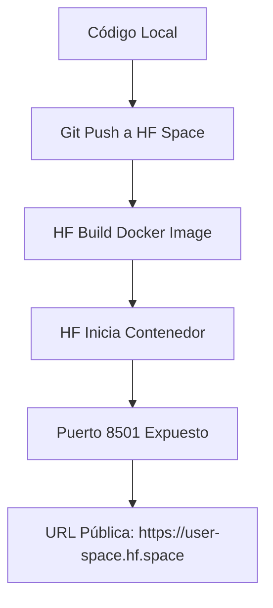

# Plan de Proyecto: Sistema de Reconocimiento de Lenguaje de Señas en Tiempo Real

## Visión General
Sistema de visión computacional que reconoce lenguaje de señas en tiempo real utilizando cámara del dispositivo (smartphone, tablet o computador). Arquitectura de microservicios con gRPC, UI en Streamlit y despliegue en Hugging Face Spaces.

---

## Roles del Proyecto

| Rol | Responsable | Responsabilidad |
|-----|-------------|-----------------|
| **Product Owner (PO)** | Tú | Define la visión, prioriza el backlog, valida entregables |
| **Scrum Master** | Yo | Facilita el proceso, elimina bloqueos, asegura metodología ágil |
| **Líder Técnico / AI Senior** | Yo | Decisiones arquitectónicas, calidad del código, buenas prácticas |

---

## Stack Tecnológico

### Lenguajes y Frameworks

| Componente | Tecnología | Justificación |
|------------|-----------|---------------|
| **Frontend UI** | Streamlit | Permite crear interfaces de datos/ML rápidamente en Python puro, sin necesidad de JavaScript. Ideal para prototipos y aplicaciones de IA. |
| **Manejador de Paquetes** | [uv](https://docs.astral.sh/uv/) | Gestor de paquetes Python escrito en Rust (del equipo de Ruff). Hasta 10-100x más rápido que pip. Equivalente a pip + pip-tools + poetry + virtualenv en una sola herramienta. Permite `uv sync`, `uv add`, `uv run`, `uv build`. Gestiona dependencias por microservicio vía `pyproject.toml`. |
| **Captura de Cámara** | Streamlit + WebRTC | WebRTC es el estándar web para video en tiempo real. Permite capturar cámara desde el navegador del usuario (smartphone, tablet, PC) y enviar frames al servidor. Sin WebRTC no podríamos acceder a la cámara desde la nube. |
| **Procesamiento de Imágenes** | OpenCV | OpenCV se ejecuta del lado del servidor (microservicio de inferencia). Recibe el frame vía gRPC, lo procesa (redimensionar, normalizar, dibujar bounding boxes) y devuelve el resultado. |
| **Modelo de Visión** | YOLOv7 + PyTorch | YOLOv7 es el estado del arte en detección de objetos en tiempo real. PyTorch es el framework nativo de YOLOv7, con mejor soporte para ONNX, TensorRT y MLflow. |
| **Framework ML** | PyTorch | Nativo de YOLOv7, mejor rendimiento en inferencia, mejor integración con MLflow y ONNX Runtime. Keras/TF no es recomendado porque requeriría convertir el modelo con riesgo de pérdida de fidelidad. |
| **Formato del modelo** | `.pt` en desarrollo, `.onnx` en producción | Entrenamos con `.pt` (rápido de iterar). Para el servicio de inferencia en producción exportamos a `.onnx` (hasta 40% más rápido en CPU, framework agnóstico, estándar industrial). |
| **Comunicación** | gRPC + Protocol Buffers | Comunicación binaria sobre HTTP/2. Más rápido y eficiente que REST/JSON para enviar frames de video. Define contratos tipados estrictos. |
| **MLOps** | MLflow | Tracking de experimentos, versionado de modelos, model registry. Permite saber qué versión del modelo está en producción y por qué. |
| **Contenedores** | Docker + Docker Compose | Docker empaqueta cada microservicio con sus dependencias. Docker Compose orquesta ambos servicios. |
| **Despliegue** | Hugging Face Spaces (Docker SDK) | Plataforma gratuita con soporte para GPU, Docker y URLs públicas HTTPS (obligatorio para WebRTC/cámara). |

---

## Arquitectura del Sistema

```
┌──────────────────────────────────────────────────────────────┐
│                    Hugging Face Space                         │
│  ┌─────────────────────────────────────────────────┐         │
│  │           Docker Container (multistage)          │         │
│  │                                                   │         │
│   │  ┌─────────────────┐      gRPC      ┌──────────────┐│         │
│   │  │   UI Service    │ ◄────────────► │  Inference   ││         │
│   │  │   (Streamlit)   │   localhost:50051│   Service    ││         │
│   │  │   Port 8501     │                │ ONNX Runtime ││         │
│   │  │   WebRTC        │                │  (YOLOv7)    ││         │
│   │  │   OpenCV (dibujo)│                │  OpenCV      ││         │
│   │  └─────────────────┘                │  (proc.)     ││         │
│   │                                      └──────────────┘│         │
│  └─────────────────────────────────────────────────┘         │
│                                                              │
│                    MLflow Server (opcional)                   │
│                    Puerto 5000 (interno)                      │
└──────────────────────────────────────────────────────────────┘
                              │
                              │ HTTPS (Internet)
                              │
                    ┌──────────────────┐
                    │   Usuario Final   │
                    │ (Browser/Laptop)  │
                    │ (Smartphone)      │
                    │ (Tablet)          │
                    └──────────────────┘
```

### ¿Por qué microservicios separados si están en el mismo contenedor?

1. **Separación de responsabilidades:** El código de UI no mezcla lógica de modelos. Puedes probar el inference-svc con `pytest` sin abrir Streamlit.
2. **Escalabilidad futura:** En AWS/GCP escalas 3 réplicas de UI (CPU baratas) y 1 de Inference (GPU cara). El código no cambia.
3. **gRPC tiene sentido:** Si todo estuviera en el mismo proceso, usar un `import` sería más simple. La separación física justifica la comunicación por gRPC.
4. **Independencia de despliegue:** Actualizas el modelo registrando una nueva versión en MLflow sin tocar la UI.

### ¿Por qué Streamlit y no NextJS?

- Streamlit está escrito en **Python puro**, igual que el modelo. No necesitas dos lenguajes.
- Streamlit + WebRTC tiene bibliotecas maduras (`streamlit-webrtc`).
- Para un MVP de IA, el tiempo de desarrollo se reduce drásticamente.
- Si en el futuro necesitas una app más compleja, migras el frontend a NextJS dejando intacto el inference-svc.

---

## MLOps con MLflow

### ¿Qué es MLOps?
Es la aplicación de prácticas de DevOps al Machine Learning: automatización, monitoreo, versionado, reprod ucción.

### ¿Qué es MLflow?
Es la herramienta que implementa MLOps. Componentes:

| Componente | Función | Cómo lo usamos |
|------------|---------|----------------|
| **MLflow Tracking** | Registrar parámetros, métricas y artefactos de cada entrenamiento | Cada entrenamiento de YOLOv7 se registra con hiperparámetros, mAP, pérdida |
| **MLflow Model Registry** | Versionar modelos y promoverlos a producción | El inference-svc descarga el modelo etiquetado como "Production" |
| **MLflow Artifacts** | Almacenar el archivo del modelo (`.pt` o `.onnx`) | Se guarda en un bucket S3 simulado o local |

### Flujo MLOps

```
Entrenamiento local (.pt)
       │
       ▼
Registro en MLflow (Tracking)
       │
       ▼
Exportar a .onnx (producción)
       │
       ▼
Model Registry: Staging → Production
(subir .pt + .onnx como artefactos)
       │
       ▼
Inference Service descarga modelo .onnx de Production
       │
       ▼
gRPC Server expone inferencia
```

---

## Pipeline de Datos

### Dataset: Sign Language Dataset for YOLOv7

**Fuente:** Kaggle - daskoushik/sign-language-dataset-for-yolov7

**Descarga:**
```bash
curl -L -o ~/Downloads/sign-language-dataset-for-yolov7.zip \
  https://www.kaggle.com/api/v1/datasets/download/daskoushik/sign-language-dataset-for-yolov7
```

**Estructura del dataset:**
```
dataset/
├── train/
│   ├── images/
│   └── labels/
├── valid/
│   ├── images/
│   └── labels/
└── test/
    ├── images/
    └── labels/
```

**Preprocesamiento:**
- Normalización de imágenes (640x640 para YOLO11n)
- División train/val/test
- Verificación de integridad de etiquetas

### EDA y Balanceo de Clases

**Script:** `data/eda.py` — genera:

| Output | Descripción |
|--------|-------------|
| `eda_output/class_distribution.png` | Barras por clase y split |
| `eda_output/bbox_analysis.png` | Histogramas + heatmap de centros |
| `eda_output/per_class_bbox.png` | Boxplot de áreas por clase |
| `eda_output/report.md` | Reporte narrativo con hallazgos y storytelling |

**El reporte (`report.md`) se mostrará en el frontend** (UI Service, Sprint 3) para dar contexto al usuario sobre el dataset, el desbalance y la estrategia de balanceo aplicada.

**Estrategia de balanceo en `training/train.py`:**
- `compute_class_weight('balanced', ...)` de sklearn calcula pesos inversamente proporcionales a la frecuencia de cada clase y los pasa como `cls_pw` a `model.train()`
- Peso máximo para la clase minoritaria (B: 2.0), mínimo para la mayoritaria (I, J: 1.0)

---

## Roadmap de Sprints

### Sprint 0: Infraestructura y Contrato ✅
| Tarea | Rama | Estado | Archivos creados |
|-------|------|--------|------------------|
| 1. Contrato gRPC | `feature/grpc-contract` | ✅ | `proto/vision.proto`, `pyproject.toml` (x2), `Makefile`, `.gitignore` |
| 2. Docker Setup | `feature/docker-setup` | ✅ | `Dockerfile` (x2), `docker-compose.yml`, `.dockerignore`, stubs server/app |
| 3. Descarga dataset | `feature/download-dataset` | ✅ | `data/download_dataset.py` |
| 4. MLflow setup | `feature/mlflow-setup` | ✅ | `mlflow/config.py`, `mlflow/experiment.py`, docker-compose mlflow service |

### Sprint 1: EDA + Entrenamiento del Modelo
| Tarea | Rama | Estado | Descripción | DoD |
|-------|------|--------|-------------|-----|
| Pipeline de entrenamiento | `feature/mlflow-setup` | ✅ | Código de training (train.py, mlflow_setup.py, dataset.yaml) | Entrenamiento invocable con `uv run python train.py` |
| EDA y balanceo de clases | `feature/eda-data-distribution` | ✅ | Análisis exploratorio de distribución, bounding boxes, integridad; estrategia de balanceo | Reporte narrativo (`report.md`) + visualizaciones guardadas; `train.py` usa `compute_class_weight('balanced')` vía `cls_pw` |
| Entrenar YOLO11n | `feature/train-yolo11n` | ✅ | Entrenamiento con el dataset usando class weights según EDA | mAP > 0.8 en validación |
| MLflow Tracking | `feature/train-yolo11n` | ✅ | Registrar experimento con parámetros, métricas y artefactos | Parámetros y métricas visibles en UI de MLflow |
| Exportar modelo (.onnx) | `feature/train-yolo11n` | ✅ | Exportar el `.pt` entrenado a `.onnx` | Inferencia en ONNX Runtime funcional y validada contra `.pt` original |
| Model Registry | `feature/train-yolo11n` | ✅ | Subir ambos artefactos (`.pt` + `.onnx`) y registrar como "Production" | Modelo disponible para descarga vía API |

### Sprint 2: Inference Service (gRPC Server) ✅
| Tarea | Descripción | DoD |
|-------|-------------|-----|
| Implementar servidor gRPC | `inference-svc/src/server.py` con `RecognizeStream` | ✅ Responde correctamente a requests de prueba |
| Carga desde MLflow | `mlflow_loader.py` descarga modelo registrado | ✅ Modelo cargado desde MLflow (v2 Production) |
| Detección + dibujo | `process.py` con YOLO `predict()` y `draw_detections()` | ✅ Frame procesado y bounding boxes dibujados |
| Pruebas unitarias | Pytest con mocks (19 tests) | ✅ Coverage 83% en código propio |

### Sprint 3: UI Service (Streamlit)
| Tarea | Descripción | DoD |
|-------|-------------|-----|
| Interfaz de cámara | WebRTC integrado | Video en tiempo real visible en navegador |
| gRPC Client | Conectar con Inference Service | Frames enviados y predicciones recibidas |
| Overlay de resultados | Dibujar bounding boxes | Letra detectada visible en el video |
| Pruebas de integración | Flujo completo | Cámara → gRPC → Predicción → Display |

### Sprint 4: Dockerización y Despliegue
| Tarea | Descripción | DoD |
|-------|-------------|-----|
| Docker multistage | Imagen optimizada | Imagen < 2GB |
| CI/CD | Scripts de build y push | `docker build` exitoso |
| Hugging Face deploy | Space funcionando | URL pública accesible y funcional |
| Documentación | README.md actualizado | Instrucciones claras de uso |

---

## Despliegue en Hugging Face Spaces

### ¿Por qué Hugging Face y no Vercel?

1. **GPU gratuita:** Hugging Face ofrece aceleración GPU para Spaces, crítica para YOLOv7.
2. **Soporte Docker nativo:** Puedes subir tu propio `Dockerfile`.
3. **HTTPS obligatorio:** WebRTC requiere HTTPS. HF lo provee automáticamente.
4. **Comunidad ML:** Es la plataforma estándar para desplegar modelos de IA.

### Método de Despliegue



**Estrategia Senior:**
- Crearemos un `Dockerfile` multistage para minimizar el tamaño de la imagen.
- Ambos servicios (UI e Inference) corren en el **mismo contenedor** pero como **procesos separados** (multi-stage build + supervisord o script de entrypoint).
- El Entrypoint inicia el servidor gRPC en background, luego Streamlit en foreground.
- En los Dockerfiles, usaremos `uv` para instalar dependencias:
  ```dockerfile
  FROM python:3.11-slim
  COPY --from=ghcr.io/astral-sh/uv:latest /uv /bin/uv
  
  WORKDIR /app
  COPY pyproject.toml uv.lock ./
  RUN uv sync --frozen --no-dev
  COPY src/ ./src/
  CMD ["uv", "run", "python", "src/server.py"]
  ```

### Configuración de Hugging Face Space

1. Crear Space con SDK: **Docker**
2. Hardware: **CPU basic** (gratuito) o **GPU upgrade** (opcional)
3. Variables de entorno:
   - `GRPC_PORT=50051`
   - `MLFLOW_TRACKING_URI=http://localhost:5000` (si aplica)

---

## Pruebas

| Tipo | Herramienta | Qué probamos |
|------|-------------|--------------|
| Unitarias | Pytest | Funciones de preprocesamiento, serialización gRPC, lógica de negocio |
| gRPC | pytest-grpc | Requests/responses del servicio de inferencia |
| Integración | Pytest + Docker | Flujo completo: UI → gRPC → Inference |
| Modelo | MLflow eval | Precisión, recall, mAP en conjunto de validación |

---

## Estructura de Directorios Propuesta

```
vc-lenguaje-senas/
├── proto/                      # Contrato gRPC
│   └── vision.proto
├── inference-svc/              # Microservicio de Inferencia
│   ├── src/
│   │   ├── __init__.py
│   │   ├── server.py          # gRPC Server
│   │   ├── model.py           # Carga y ejecución de YOLOv7
│   │   └── preprocess.py      # OpenCV preprocessing
│   ├── tests/
│   │   └── __init__.py
│   ├── pyproject.toml          # Dependencias del inference-svc (uv)
│   └── Dockerfile
├── ui-svc/                     # Microservicio de UI
│   ├── src/
│   │   ├── __init__.py
│   │   ├── app.py             # Streamlit app
│   │   ├── webrtc_handler.py  # WebRTC + cámara
│   │   └── grpc_client.py     # Cliente gRPC
│   ├── tests/
│   │   └── __init__.py
│   ├── pyproject.toml          # Dependencias del ui-svc (uv)
│   └── Dockerfile
├── data/                       # Dataset y scripts
│   └── download_dataset.py
├── mlflow/                     # MLflow config
├── docker-compose.yml          # Orquestación local
├── Dockerfile                  # Multistage para HF
├── entrypoint.sh               # Entrypoint para HF
├── plan.md                     # Este archivo
├── README.md
└── .gitignore
```

---

## Notas Técnicas Clave

### ¿Por qué gRPC y no REST?
- **Binario vs Texto:** Los frames de video en JSON serían enormes (base64). gRPC envía bytes crudos.
- **HTTP/2:** Multiplexación, menor latencia.
- **Contrato estricto:** El archivo `.proto` define exactamente qué se envía y recibe. Tipado fuerte.

### ¿Por qué OpenCV en el servidor y no en el cliente?
- El cliente (navegador) no puede ejecutar OpenCV fácilmente.
- WebRTC captura el frame como `bytes` → gRPC lo envía al servidor → OpenCV lo procesa.
- El servidor devuelve coordenadas + clase, y el cliente dibuja el overlay en el canvas.

### ¿Por qué uv en lugar de pip/poetry?

`uv` es el gestor de paquetes moderno que está reemplazando a pip/poetry en la industria:

| Característica | pip + venv | poetry | uv |
|----------------|-----------|--------|-----|
| Velocidad de instalación | Lento | Medio | **10-100x más rápido** |
| Resolución de dependencias | Lenta (pip-compile) | Buena | **Instantánea** |
| Lock file | requirements.txt | poetry.lock | **uv.lock** |
| Virtualenv automático | ❌ (manual) | ✅ | ✅ |
| Compatibilidad Docker | Buena | Regular | **Excelente (uv sync --frozen)** |
| Herramienta única | ❌ (pip + venv + pip-tools) | ❌ (solo poetry) | ✅ (uv = pip + venv + pip-tools + poetry) |

**En este proyecto:**
- Cada microservicio tiene su `pyproject.toml` con sus dependencias
- `uv lock` genera `uv.lock` (determinista, reproducible)
- `uv sync` instala exactamente lo que está en el lock
- En Docker: `uv sync --frozen --no-dev` para instalar solo lo necesario en producción
- No más `requirements.txt` ni `pip install`

### MLOps: ¿Por qué es importante para un Senior?
- **Reproducibilidad:** Sabes exactamente qué datos e hiperparámetros produjeron cada modelo.
- **Gobernanza:** Sabes qué versión del modelo está en producción y puedes hacer rollback.
- **Colaboración:** MLflow permite compartir experimentos con el equipo.

---

## Reglas del Proyecto

1. **No se avanza a la siguiente fase sin autorización explícita.**
2. **Cada Sprint termina con una demo funcional.**
3. **Todo el código debe tener pruebas.**
4. **Las decisiones técnicas se documentan en este archivo.**
5. **El Scrum Master (yo) es responsable de recordar las reglas.**

---

*Documento creado: 26/05/2026*
*Última actualización: 01/06/2026*
*Progreso: Sprint 0 completado ✅ | Sprint 1 completado ✅ | Sprint 2 completado ✅ | Sprint 3 pendiente*
